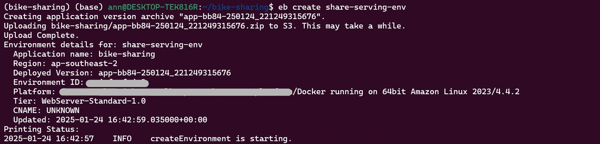
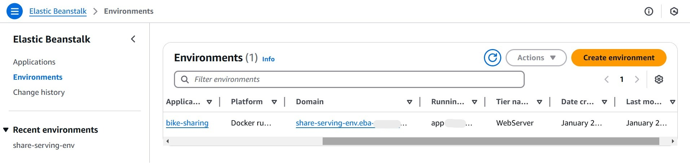
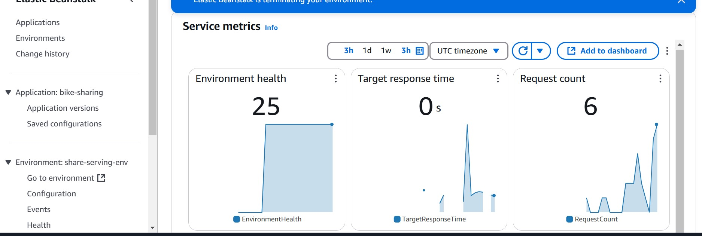

# Bike Share Prediction
This project predicts bike rental usage using machine learning by analyzing a variety of factors such as weather conditions, temporal features (hour, day, month, year), and other attributes like holiday status and seasonality. Multiple models, including Linear Regression, Decision Tree, Random Forest, and XGBoost, were trained and evaluated to determine the most accurate predictor. XGBoost was selected as the best-performing model. The final model is served through a Flask API, containerized with Docker for seamless deployment, and hosted on AWS Elastic Beanstalk for scalable and managed deployment.

---

## Problem Statement

Bike-sharing programs help reduce traffic congestion and promote a more sustainable way of commuting. Accurately predicting the demand for bikes can help optimize bike availability. This project aims to predict the number of bike rentals based on features such as weather, temperature, humidity, and season.

---

## Solution

1. **Model Training**:
   - Multiple models were trained and evaluated for performance.
   - XGBoost was selected as the best model because it gave the least **RMSE** (Root Mean Squared Error), which was our primary evaluation metric.
   - The trained XGBoost model was saved as `model.bin`.

2. **Deployment**:
   - A Flask API is used to serve the XGBoost model, enabling real-time predictions.
   - Docker is employed to containerize the application for consistent and easy deployment.
   - The application is deployed using **AWS Elastic Beanstalk**, which automatically handles environment provisioning, load balancing, scaling, and application health monitoring.

---

## Dataset

The dataset used for training the models is available [here](https://www.kaggle.com/datasets/hmavrodiev/london-bike-sharing-dataset/data).  

---

## How to Set Up and Run the Project

### 1. Clone the Repository
```bash
git clone https://github.com/Ann-M-R/Bike-sharing.git
cd Bike-sharing
```

### 2. Install Dependencies

Install Python dependencies using Pipenv:
```bash
pip install pipenv
pipenv install
pipenv shell
```

### 3. Run the Flask Application Locally

To run without Docker:
```bash
gunicorn --bind 0.0.0.0:9696 predict:app
```

The API will run at http://localhost:9696/predict.

To test the app:
```bash
python predict-test.py
```

### Using Docker

### 1.Build the Docker Image
```bash
docker build -t bike-sharing-prediction .
```

### 2. Run the Docker Container
```bash
docker run -p 9696:9696 bike-sharing-prediction
```

### Deploying on AWS Elastic Beanstalk

### 1.Initialize Elastic Beanstalk:
   - Make sure you have the Elastic Beanstalk CLI installed.
   - Run the following to initialize the EB environment:
```bash
eb init -p docker -r <region> bike-sharing
```

### 2. Create an Environment and Deploy:
```bash
eb create bike-sharing-env
```

### 3. Access the Deployed Application:
   - After deployment, Elastic Beanstalk will provide the application URL `bike-serving-env.eba-xxxxxx.xxxxxxxxx.elasticbeanstalk.com`

### 4. Test the Application:
   - Update the `predict-test.py` file with the Elastic Beanstalk URL.
```bash
host = 'bike-serving-env.eba-xxxxxx.xxxxxxxxx.elasticbeanstalk.com'
url = f'http://{host}/predict'
```

   - Run the following command to test the deployed API:
```bash
python predict-test.py
```

---


## Files in the Repository

- `notebook.ipynb`: Contains data exploration, feature engineering, and training of multiple models (Linear Regression, Decision Tree, Random Forest, XGBoost).
- `train.py`: Script to train the best model and save it as `model.bin`.
- `predict.py`: Flask application for serving predictions.
- `predict-test.py`: Script to test the Flask API.
- `model.bin`: Saved XGBoost model.
- `bike_share_dataset.csv`: Dataset used for training.
- `Dockerfile`: Docker configuration file.
---


## Cloud Deployment Using Elastic Beanstalk

### Creating Environment  

  

### AWS Environments Console  
The deployed environment is visible in the AWS Elastic Beanstalk console:  

  

### Monitoring Tab of the Environment  

  


